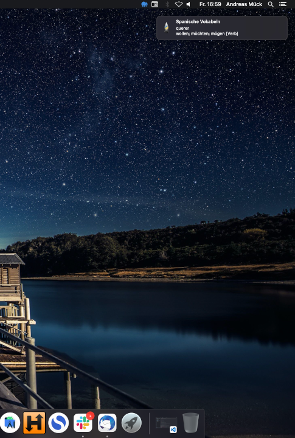

## vocab-notifier [ES/DE]
This little programme can support you to learn Spanish vocabulary 
A pop-up appears every few seconds with a random Spanish word. 

## How to use
1. Install `plyer` for python3: `pip3 install plyer`
2. Run: `python3 vocab.pyw`

## Configuration
Look into the source code `vocab.pyw` to change the timer 
Feel free to add new words in `wordlist.json` 

## Other languages
F.e. to learn català :grin: you can change 
`language1 = rnd_word['spanish']` into `language1 = rnd_word['catala']` 
and adjust the keys and words in the `wordlist.json` file accordingly. 

Saludos y Pozdrawiam :relaxed:  
